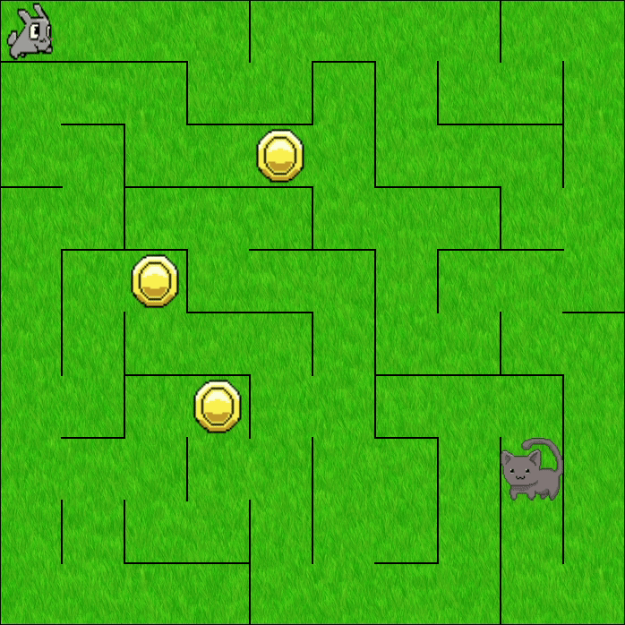

# pathfinding-maze-game
  

This is a game that generates a maze using a depth-first search algorithm. The objective of the player is to traverse the maze to collect all the coins while trying to avoid the enemy. The enemy is continuously chasing the player, its path is generated using a breadth-first search algorithm.

## Run this project  
Maven can be used to run this program through the command line with the following command.

    mvn clean javafx:run

Alternatively this project can be imported into IntelliJ to  build and run.

## Credits
**Image Credits**  
Coin image is from [opengameart.org/content/spinning-coin-8-bit-sprite](https://opengameart.org/content/spinning-coin-8-bit-sprite)  
Cat image is from [opengameart.org/content/pixel-cat](https://opengameart.org/content/pixel-cat)  
Rabbit image is from [opengameart.org/content/rabbit-2](https://opengameart.org/content/rabbit-2)

**Maven**  
The maven build files that I have modified for this project can be found at  
[github.com/openjfx/samples/tree/master/IDE/IntelliJ/Modular/Maven](https://github.com/openjfx/samples/tree/master/IDE/IntelliJ/Modular/Maven)   Copyright (c) 2019, Gluon